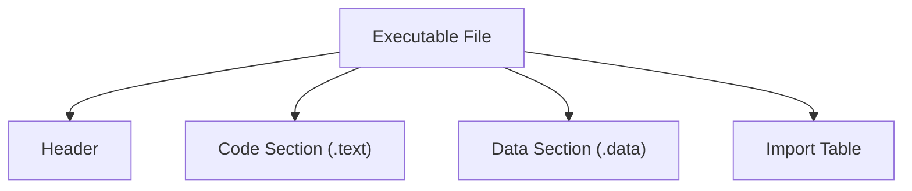
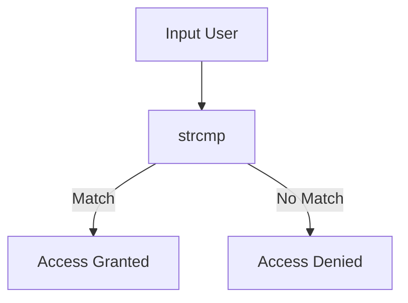
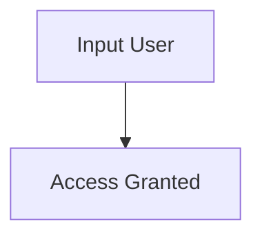

# Fundamental Reverse Engineering

Reverse Engineering (RE) itu bukan sekadar “membaca program orang lain”, tapi proses memahami **bagaimana sebuah program bekerja tanpa melihat source code-nya**. Biasanya dilakukan terhadap binary (hasil compile), seperti `.exe`, ELF, atau library.

Kalau kamu masuk ke dunia ini, mindset yang perlu dipegang:

> Kamu tidak membaca kode → kamu **merekonstruksi logika dari sesuatu yang sudah “dirusak” oleh compiler**.

---

# 1. Fondasi Paling Dasar: Assembly

## Apa itu Assembly?

Assembly adalah bahasa level rendah yang:

- Sangat dekat dengan mesin (CPU)
- Representasi langsung dari instruksi yang dieksekusi

Contoh sederhana:

```asm
mov eax, 5
add eax, 3
```

Artinya:

- Simpan 5 ke register `eax`
- Tambahkan 3 → hasil = 8

---

## Kenapa Assembly Penting?

Karena:

- Semua program yang di-compile → jadi assembly
- Reverse engineering = membaca assembly (atau hasil dekompilasi)

Kalau kamu skip ini:

- Kamu cuma “nebak-nebak”, bukan reverse

---

## Konsep Penting di Assembly

### 1. Register

Register = tempat penyimpanan kecil di CPU

Contoh:

- `eax`, `ebx`, `ecx`, `edx` (x86)
- `rax`, `rbx` (x64)

---

### 2. Memory

Akses memori:

```asm
mov eax, [ebp-4]
```

Artinya:

- Ambil nilai dari stack

---

### 3. Control Flow

```asm
cmp eax, 5
je label_true
```

Artinya:

- Kalau eax == 5 → lompat

Ini setara dengan:

```c
if (eax == 5)
```

---

# 2. Dari High-Level ke Assembly

Contoh C:

```c
int add(int a, int b) {
    return a + b;
}
```

Hasil assembly kira-kira:

```asm
mov eax, [a]
add eax, [b]
ret
```

Insight penting:

- Nama variabel hilang
- Struktur jadi sederhana
- Tapi logika tetap ada

---

# 3. Struktur Executable

Executable bukan sekadar “file program”, tapi punya struktur.

## Contoh (simplified):



### Bagian penting:

- `.text` → kode program
- `.data` → data statis
- Import table → fungsi eksternal (printf, dll)

---

# 4. Tools Reverse Engineering

Beberapa tools umum:

- **Ghidra** → gratis, powerful
- **IDA Pro** → standar industri
- **x64dbg** → debugging
- **radare2** → CLI hardcore
- **strings** → ekstrak string

---

# 5. Static vs Dynamic Analysis

## Static Analysis

- Tidak menjalankan program
- Analisis file langsung

Contoh:

- baca disassembly
- lihat string

---

## Dynamic Analysis

- Jalankan program
- Observasi behavior

Contoh:

- breakpoint
- memory inspection

---

# 6. Teknik Dasar Reverse

## 1. Strings Analysis

```bash
strings program.exe
```

Cari:

- password
- URL
- error message

Kadang ini saja sudah cukup.

---

## 2. Control Flow Analysis

Cari:

- if condition
- loop
- fungsi penting

---

## 3. Function Identification

Biasanya:

- main
- validasi input
- enkripsi

---

# 7. Study Case: Reverse Executable Sederhana

## Program Target (Bayangan)

Misalnya ada program:

```c
#include <stdio.h>
#include <string.h>

int main() {
    char input[20];
    printf("Enter password: ");
    scanf("%s", input);

    if (strcmp(input, "secret123") == 0) {
        printf("Access Granted\n");
    } else {
        printf("Access Denied\n");
    }
}
```

---

## Step 1: Strings

```bash
strings target.exe
```

Output:

```
Enter password:
Access Granted
Access Denied
secret123
```

Langsung mencurigakan:

> "secret123"

---

## Step 2: Load ke Ghidra

Di Ghidra kamu akan lihat:

```c
if (strcmp(input,"secret123") == 0)
```

Atau dalam assembly:

```asm
call strcmp
test eax, eax
je success
```

Interpretasi:

- `eax == 0` → password benar

---

## Step 3: Bypass Logic

Ada beberapa cara:

### Cara 1: Patch Binary

Ubah:

```asm
je success
```

jadi:

```asm
jmp success
```

Artinya:

- Selalu masuk “Access Granted”

---

### Cara 2: Dynamic Debugging

Di x64dbg:

- Set breakpoint di `strcmp`
- Force return value = 0

---

## Diagram Flow



Setelah patch:



---

# 8. Strategi Reverse (Realistis)

## 1. Jangan Langsung Baca Semua

Fokus:

- Input
- Output
- Decision point

---

## 2. Cari “Interesting Function”

Biasanya:

- strcmp
- memcmp
- crypto function

---

## 3. Gunakan Kombinasi Static + Dynamic

Static:

- pahami struktur

Dynamic:

- verifikasi

---

## 4. Pattern Recognition

Semakin sering kamu reverse:

- kamu mulai kenal pola compiler
- kamu bisa “tebak” lebih cepat

---

# 9. Kesalahan Umum

- Terlalu bergantung pada decompiler
- Tidak paham assembly dasar
- Tidak tracing alur program
- Overthinking (padahal password ada di string)

---

# 10. Penutup

Reverse engineering itu skill yang:

- Butuh latihan (banyak)
- Butuh kesabaran
- Lebih ke **analisis logika** daripada hafalan

Kalau disederhanakan:

> Assembly = bahasa
> Binary = puzzle
> Reverse engineering = proses menyusun ulang puzzle itu
