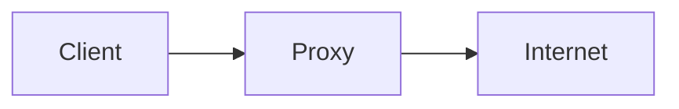
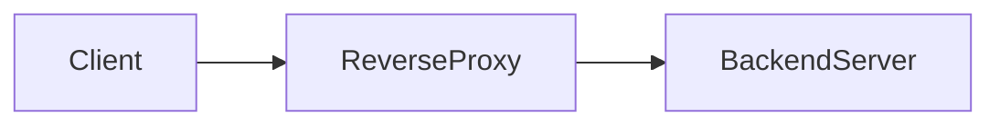

## Pengertian Dasar

Secara sederhana, proxy adalah perantara antara client dan server. Ketika client ingin mengakses suatu resource, request tidak langsung dikirim ke server tujuan, tetapi melewati proxy terlebih dahulu.

Sementara reverse proxy adalah kebalikannya. Ia berada di sisi server dan menerima request dari client, lalu meneruskannya ke backend server yang sesuai. Client tidak pernah berinteraksi langsung dengan server backend.

---

## Proxy (Forward Proxy)

Forward proxy digunakan oleh client untuk mengakses internet melalui perantara.

### Cara Kerja



Proxy akan:

- Meneruskan request ke server tujuan
- Menerima response
- Mengembalikannya ke client

### Fungsi Umum

- Menyembunyikan IP client (anonymity)
- Filtering konten (misalnya di kantor/sekolah)
- Caching untuk efisiensi bandwidth
- Bypass restriction (tergantung konfigurasi)

### Contoh Use Case

- Jaringan kantor yang membatasi akses website tertentu
- User menggunakan proxy untuk menyembunyikan identitas

---

## Reverse Proxy

Reverse proxy berada di depan server (backend) dan menangani request dari client.

### Cara Kerja



Reverse proxy akan:

- Menerima request dari client
- Menentukan backend mana yang harus menangani
- Mengirim request ke backend
- Mengembalikan response ke client

### Fungsi Utama

- Load balancing
- SSL termination
- Caching
- Security layer (WAF, rate limiting)
- Menyembunyikan struktur backend

### Contoh Use Case

- Website besar dengan banyak server backend
- API gateway
- Deployment microservices

---

## Perbedaan Utama

| Aspek      | Forward Proxy        | Reverse Proxy             |
| ---------- | -------------------- | ------------------------- |
| Posisi     | Dekat client         | Dekat server              |
| Tujuan     | Melindungi client    | Melindungi server         |
| Visibility | Server tahu proxy    | Client tidak tahu backend |
| Use case   | Filtering, anonymity | Load balancing, security  |

---

## Implementasi di Ubuntu

Biasanya digunakan:

- Nginx (reverse proxy)
- Squid (forward proxy)

---

## Reverse Proxy dengan Nginx

### Install Nginx

```bash
sudo apt update
sudo apt install nginx -y
```

### Konfigurasi Reverse Proxy

Edit file:

```bash
sudo nano /etc/nginx/sites-available/reverse-proxy
```

Contoh konfigurasi:

```nginx
server {
    listen 80;
    server_name example.com;

    location / {
        proxy_pass http://127.0.0.1:3000;
        proxy_set_header Host $host;
        proxy_set_header X-Real-IP $remote_addr;
    }
}
```

Aktifkan config:

```bash
sudo ln -s /etc/nginx/sites-available/reverse-proxy /etc/nginx/sites-enabled/
sudo nginx -t
sudo systemctl reload nginx
```

### Penjelasan Singkat

`proxy_pass` menentukan backend  
`X-Real-IP` menjaga informasi IP client  
`Host` memastikan header tetap sesuai

---

## Forward Proxy dengan Squid

### Install Squid

```bash
sudo apt install squid -y
```

### Konfigurasi Dasar

Edit file:

```bash
sudo nano /etc/squid/squid.conf
```

Contoh sederhana:

```conf
http_port 3128

acl localnet src 192.168.1.0/24
http_access allow localnet
http_access deny all
```

Restart:

```bash
sudo systemctl restart squid
```

### Cara Pakai

Client mengatur proxy ke:

```
IP_SERVER:3128
```

---

## Best Practice

### 1. Security

- Gunakan HTTPS (SSL termination di reverse proxy)
- Tambahkan rate limiting
- Gunakan firewall (ufw/iptables)
- Jangan expose backend langsung ke publik

### 2. Header Management

Pastikan header penting diteruskan:

```nginx
proxy_set_header X-Forwarded-For $proxy_add_x_forwarded_for;
proxy_set_header X-Forwarded-Proto $scheme;
```

Ini penting untuk logging dan aplikasi backend.

---

### 3. Load Balancing (Nginx)

```nginx
upstream backend {
    server 127.0.0.1:3000;
    server 127.0.0.1:3001;
}

server {
    listen 80;

    location / {
        proxy_pass http://backend;
    }
}
```

---

### 4. Logging

Aktifkan logging untuk monitoring:

```bash
/var/log/nginx/access.log
/var/log/nginx/error.log
```

Analisa log penting untuk:

- deteksi serangan
- debugging
- audit traffic

---

### 5. Isolation

- Jalankan backend di private network
- Gunakan container (Docker) jika perlu
- Reverse proxy jadi satu-satunya entry point

---

### 6. Caching (Opsional)

Untuk performa:

```nginx
proxy_cache_path /data/nginx/cache levels=1:2 keys_zone=my_cache:10m max_size=1g;

location / {
    proxy_cache my_cache;
    proxy_pass http://backend;
}
```
