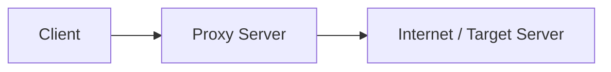
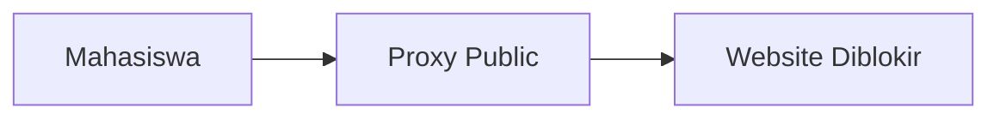
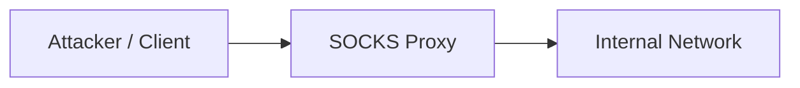
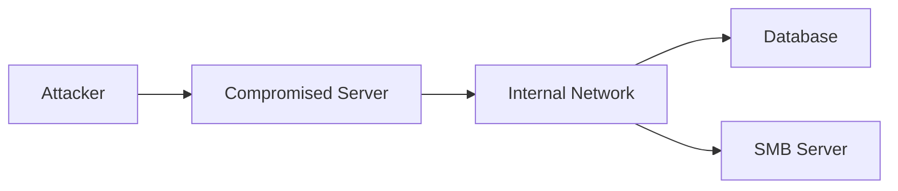
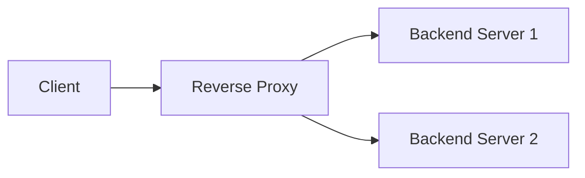
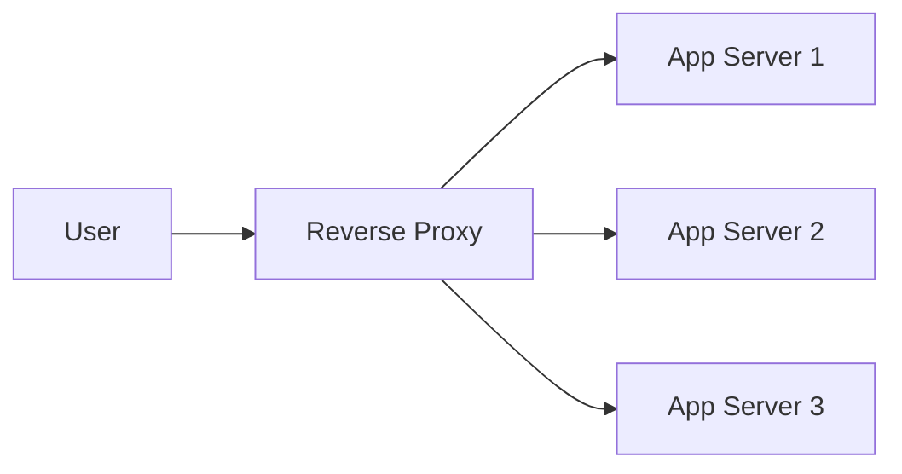
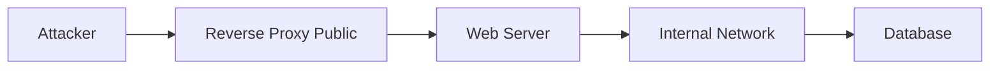

# SOCKS Proxy, Proxy, dan Reverse Proxy

Topik ini sering disalahpahami karena istilahnya mirip, padahal fungsi dan posisinya di arsitektur jaringan berbeda cukup jauh. Kalau dilihat secara sederhana:

- **Proxy** → mewakili client
- **SOCKS Proxy** → proxy level rendah (lebih fleksibel)
- **Reverse Proxy** → mewakili server

Tapi kalau berhenti di situ, pemahamannya terlalu dangkal. Kita bedah lebih dalam.

---

# 1. Proxy (Forward Proxy)

## Konsep Dasar

Forward proxy adalah server yang berada di antara client dan internet, dan bertindak sebagai perantara request dari client ke server tujuan.

Diagram:



## Cara Kerja

1. Client kirim request ke proxy
2. Proxy meneruskan request ke target
3. Target respon ke proxy
4. Proxy kirim balik ke client

## Fungsi Utama

- Anonimitas (menyembunyikan IP client)
- Filtering (blok website tertentu)
- Caching (hemat bandwidth)
- Logging traffic

## Contoh Nyata

- Proxy di kantor / kampus
- Burp Suite (intercept HTTP request)

---

## Study Case: Bypass Filtering

Kondisi:

- Kampus blok akses ke beberapa website

Solusi:

- Gunakan proxy eksternal

Flow:



Masalahnya:

- Proxy HTTP terbatas hanya di layer aplikasi (HTTP/HTTPS)
- Tidak bisa handle traffic non-web dengan baik

---

# 2. SOCKS Proxy

## Apa Bedanya dengan Proxy Biasa?

SOCKS proxy bekerja di layer lebih rendah (Layer 5 - Session), jadi:

> Dia tidak peduli jenis traffic → TCP apapun bisa dilewatkan

Berbeda dengan HTTP proxy yang hanya paham HTTP/HTTPS.

---

## Cara Kerja



SOCKS hanya:

- Terima koneksi
- Forward raw traffic

Tanpa:

- Modifikasi header
- Interpretasi protokol

---

## Kenapa Ini Penting di Pentest?

Karena fleksibel.

Dengan SOCKS proxy:

- Bisa scan internal network
- Bisa akses service apapun (SSH, SMB, RDP, DB)
- Bisa chaining pivot

---

## Study Case: Pivoting Internal Network

Kondisi:

- Kamu sudah compromise 1 server
- Server itu punya akses ke network internal

Diagram:



---

## Implementasi (Realistis)

### Step 1: Buat SOCKS Proxy

```bash
ssh -D 1080 user@target
```

Artinya:

- Local port 1080 jadi SOCKS proxy

---

### Step 2: Gunakan proxychains

```bash
proxychains nmap -sT 10.10.10.0/24
```

Sekarang:

- Semua traffic lewat compromised server

---

## Insight Penting

SOCKS proxy = tulang punggung pivoting

Tanpa ini:

- Kamu cuma punya shell
  Dengan ini:
- Kamu punya akses jaringan

---

# 3. Reverse Proxy

## Konsep Dasar

Reverse proxy adalah server yang menerima request dari client dan meneruskannya ke backend server.

Diagram:



## Posisi

Berbeda dengan forward proxy:

- Proxy: dekat client
- Reverse proxy: dekat server

---

## Fungsi Utama

- Load balancing
- SSL termination
- Hiding backend server
- Security filtering (WAF)
- Caching

---

## Contoh Nyata

- Nginx
- Cloudflare
- HAProxy

---

## Study Case: Load Balancing

Kondisi:

- Website traffic tinggi

Arsitektur:



Reverse proxy:

- Membagi traffic
- Mencegah overload

---

## Study Case: Security Layer

Reverse proxy bisa jadi "tameng":

- Block request aneh
- Rate limiting
- Filter bot

Contoh:

- WAF rules

---

# Perbandingan Inti

| Fitur    | Proxy             | SOCKS Proxy | Reverse Proxy            |
| -------- | ----------------- | ----------- | ------------------------ |
| Posisi   | Client-side       | Client-side | Server-side              |
| Layer    | Application       | Session     | Application              |
| Protokol | HTTP/HTTPS        | Semua TCP   | HTTP/HTTPS               |
| Use Case | Filtering, anonym | Pivoting    | Load balancing, security |

---

# Perspektif Pentesting (Yang Jarang Dibahas)

## 1. Proxy → Digunakan untuk Intercept

- Burp Suite
- MITM attack
- Inspect request

---

## 2. SOCKS Proxy → Digunakan untuk Movement

- Pivoting
- Internal recon
- Network expansion

---

## 3. Reverse Proxy → Target Serangan

Kadang reverse proxy jadi entry point:

Contoh:

- Misconfig Nginx
- Header injection
- SSRF via backend routing

---

## Study Case Kompleks (Realistic Chain)



Flow serangan:

1. Exploit web app
2. Dapat shell
3. Setup SOCKS proxy
4. Scan internal
5. Akses database
