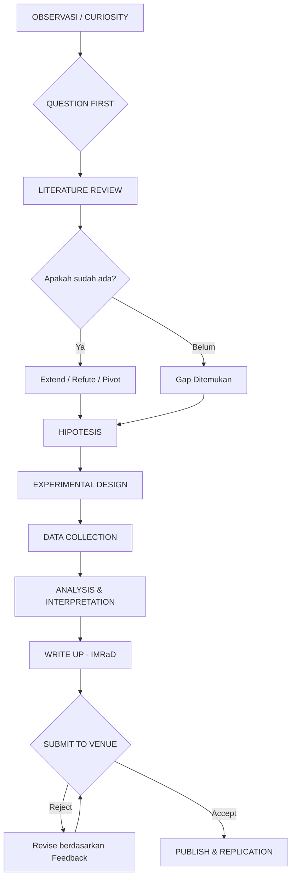

---
tags:
  - research
  - methodology
  - akademis
  - publish
  - penemuan
aliases:
  - Research Methodology
  - Cara Riset
created: 2026-04-23
status: operational
cssclasses:
  - image-grid
---
---
# 🔭 Research Methodology — Hierarki Lengkap

> [!ABSTRACT] Definisi
> Ilmu menemukan sesuatu yang belum ada. Bukan hafalan — tapi sistem berpikir. Semua penemuan besar lahir dari metodologi yang benar, bukan keberuntungan semata.

---

## 📑 Daftar Isi
1. [[#Sheet 1 — Hierarki Research: Dari Observasi sampai Paradigm Shift]]
2. [[#Sheet 2 — Tipe Penelitian dan Kapan Dipakai]]
3. [[#Sheet 3 — Dari Ide ke Publikasi: Alur Lengkap]]
4. [[#Sheet 4 — Research untuk Insinyur IT: Bedanya dengan Sains Murni]]

---

## Sheet 1 — Hierarki Research: Dari Observasi sampai Paradigm Shift

| 🔭 Level & Metode                          | ⚡ Cara Kerja & Sweet Spot                                                                                                                                                                                                                                                                                                                  | ☠️ Tembok Kematian                                                                                                                                                                                                           | 🎯 Contoh Nyata                                                                                                                                                                                                              |
| ------------------------------------------ | ------------------------------------------------------------------------------------------------------------------------------------------------------------------------------------------------------------------------------------------------------------------------------------------------------------------------------------------ | ---------------------------------------------------------------------------------------------------------------------------------------------------------------------------------------------------------------------------- | ---------------------------------------------------------------------------------------------------------------------------------------------------------------------------------------------------------------------------- |
| **Level 0** — Observasi & Curiosity        | Semua riset dimulai di sini. Melihat sesuatu yang aneh, tidak konsisten, atau belum ada penjelasannya. "Kenapa grafik kecepatan flashdisk naik-turun?" adalah contoh observasi valid. Question First: tetesan pertanyaan yang tepat lebih berharga dari jawaban.                                                                           | Bias konfirmasi — mencari bukti yang mendukung apa yang sudah kamu percaya, bukan yang membuktikan kamu salah. Observasi tanpa dokumentasi = hilang.                                                                         | Newton melihat apel jatuh. Fleming melihat jamur membunuh bakteri. Keduanya tidak melewatkan anomali.                                                                                                                        |
| **Level 1** — Literature Review            | Baca semua yang sudah ada tentang topikmu sebelum klaim "belum ada yang tahu ini." Google Scholar, Semantic Scholar, ArXiv, IEEE Xplore, ACM Digital Library. Citation chaining: dari paper A temukan paper B yang dikutipnya, terus ke belakang. Gunakan Zotero/Mendeley untuk manajemen referensi.                                       | Kebanyakan mahasiswa skip level ini dan reinvent the wheel. Atau sebaliknya: tenggelam di literature dan tidak pernah mulai riset. Batasi diri: systematic review atau scoping review, bukan baca semua.                     | Sebelum publish tentang teknik RE baru, cek dulu apakah USENIX Security atau IEEE S&P sudah punya paper serupa.                                                                                                              |
| **Level 2** — Hypothesis Formation         | Dari observasi + literature, rumuskan hipotesis yang: Spesifik, Terukur, Falsifiable (bisa dibuktikan salah). Contoh buruk: "AI itu bagus." Contoh baik: "Model BERT fine-tuned pada dataset malware report bahasa Indonesia akan mencapai F1-score >0.85 untuk klasifikasi keluarga malware."                                             | Hipotesis yang tidak falsifiable bukan sains — itu opini. Terlalu luas = tidak bisa diuji. Terlalu sempit = tidak ada kontribusi.                                                                                            | Karl Popper: sebuah teori ilmiah harus bisa dibuktikan salah. Jika tidak bisa salah, itu bukan ilmu pengetahuan.                                                                                                             |
| **Level 3** — Experimental Design          | Rancang cara membuktikan atau menyangkal hipotesismu. Variabel independen (yang kamu ubah), variabel dependen (yang kamu ukur), variabel kontrol (yang kamu jaga tetap sama). Reproducibility: orang lain harus bisa ulangi eksperimenmu dan dapat hasil sama. Baseline: bandingkan dengan metode yang sudah ada, bukan dengan kekosongan. | Confounding variable: faktor tersembunyi yang mempengaruhi hasil tanpa kamu sadari. Sample size terlalu kecil = hasil tidak signifikan secara statistik. Tidak ada control group = tidak bisa klaim kausalitas.              | A/B testing adalah experimental design paling sederhana. Randomized Controlled Trial (RCT) adalah gold standard di kedokteran.                                                                                               |
| **Level 4** — Data Collection & Validation | Kumpulkan data secara sistematis. Untuk IT: benchmark, dataset publik (Kaggle, UCI, CAIDA), capture traffic, fuzzing result, user study. Validasi: apakah data representatif? Apakah ada bias sampling? Cross-validation untuk ML. Inter-rater reliability untuk data yang butuh judgment manusia.                                         | Data leakage di ML (test set bocor ke training) = hasil bagus palsu. Survivorship bias: hanya menganalisis yang berhasil, mengabaikan yang gagal. Overfitting ke satu dataset.                                               | Semua benchmark CPU/GPU yang viral punya metodologi ketat — suhu ruangan, warmup run, jumlah iterasi, semua dikontrol.                                                                                                       |
| **Level 5** — Analysis & Interpretation    | Statistik bukan untuk mengesankan, tapi untuk mengukur kepastian. P-value, confidence interval, effect size. Untuk IT: complexity analysis, throughput, latency distribution (gunakan percentile, bukan rata-rata — P99 lebih jujur dari mean). Visualisasi: grafik yang menipu adalah bentuk kebohongan ilmiah.                           | P-hacking: coba banyak analisis sampai ketemu yang p<0.05 — ini manipulasi. Correlation ≠ causation. "Rata-rata" menyembunyikan distribusi — selalu tampilkan variance/std.                                                  | Jeff Dean (Google) selalu pakai P99 latency, bukan mean — karena mean menyembunyikan outlier yang dialami 1% user nyata.                                                                                                     |
| **Level 6** — Peer Review & Publication    | Submit ke conference atau journal. Untuk IT/CS: conference lebih prestisius dari journal (berbeda dengan bidang lain). Tier publikasi: A* > A > B > C (CORE ranking). ArXiv untuk preprint — bisa submit sebelum peer review selesai. Respond to reviewer: seni tersendiri — jangan defensif, treat reviewer sebagai kolaborator.          | Rejection bukan kegagalan — mayoritas paper di top venue ditolak (acceptance rate USENIX Security ~15%). Predatory journal: bayar langsung publish tanpa review — jebakan. Impact factor bukan satu-satunya ukuran kualitas. | Linus Torvalds tidak publish paper — tapi Dijkstra, Turing, Shannon semua publish. Untuk karir akademik, publish wajib. Untuk industri, GitHub repo bisa setara.                                                             |
| **Level 7** — Replication & Generalization | Risetmu diuji oleh orang lain di konteks berbeda. Apakah hasilnya hold? Internal validity: apakah eksperimenmu mengukur apa yang kamu kira kamu ukur? External validity: apakah hasilnya berlaku di luar setting eksperimenmu? Generalization adalah tanda penemuan yang benar-benar baru.                                                 | Replication crisis: banyak paper psikologi dan beberapa CS tidak bisa direplikasi. Overgeneralization: hasil dari satu dataset diklaim berlaku universal.                                                                    | Hasil yang hanya berlaku di lab sendiri = interesting finding. Hasil yang direplikasi 10 lab berbeda = knowledge baru yang sesungguhnya.                                                                                     |
| ☠️ **Level 8** — Paradigm Shift            | Penemuan yang mengubah cara seluruh bidang berpikir. Bukan perbaikan inkremental — tapi framework baru. Kuhn: "normal science" vs "scientific revolution." Ciri: komunitas ilmiah awalnya menolak, lalu menerima, lalu tidak bisa membayangkan dunia sebelumnya.                                                                           | Tidak bisa direncanakan — hanya bisa disiapkan. Butuh: domain expertise mendalam + cross-domain thinking + timing yang tepat + keberanian publikasi melawan konsensus.                                                       | Public key cryptography (Diffie-Hellman 1976) ditolak reviewer awal. Deep learning (Hinton 2006) diabaikan 5 tahun sebelum ImageNet 2012 membuktikannya. Transformer (Attention is All You Need, 2017) mengubah seluruh NLP. |

---

## Sheet 2 — Tipe Penelitian dan Kapan Dipakai

| Tipe                | Pertanyaan yang Dijawab                              | Metode                                            | Cocok Untuk                             |
| ------------------- | ---------------------------------------------------- | ------------------------------------------------- | --------------------------------------- |
| **Eksploratori**    | "Apa yang terjadi di sini? Belum ada yang tahu."     | Observasi, case study, interview, grounded theory | Topik baru yang belum ada framework-nya |
| **Deskriptif**      | "Seberapa besar? Seberapa sering? Seperti apa?"      | Survey, measurement, statistical description      | Karakterisasi masalah sebelum solusi    |
| **Eksplanatif**     | "Kenapa ini terjadi? Apa hubungannya?"               | Correlation analysis, regression, experiment      | Mencari penyebab, bukan hanya pola      |
| **Eksperimental**   | "Apakah X menyebabkan Y?"                            | RCT, A/B test, controlled experiment              | Klaim kausalitas yang kuat              |
| **Evaluatif**       | "Apakah solusi ini lebih baik dari yang sebelumnya?" | Benchmark, comparative study, user study          | Paper yang propose metode baru          |
| **Action Research** | "Bagaimana kita solve masalah nyata ini sekarang?"   | Iterative design, deploy, measure, adjust         | Industri, startup, open source project  |

---

## Sheet 3 — Dari Ide ke Publikasi: Alur Lengkap

### Format Paper Standar (IMRaD)
* **Abstract:** Masalah, metode, hasil (tulis paling terakhir).
* **Introduction:** Motivasi ("Why should anyone care?").
* **Related Work:** Bedakan dirimu dari penelitian sebelumnya. Jangan skip bagian ini.
* **Methodology:** Detail teknis agar bisa direplikasi orang lain (Reproducibility).
* **Results:** Data murni, grafik, dan tabel (tanpa opini).
* **Discussion:** Interpretasi, limitasi, dan kejujuran soal kelemahan riset.

---

## Sheet 4 — Research untuk Insinyur IT: Bedanya dengan Sains Murni

> [!INFO] Karakteristik CS Research
> Dalam Teknik Informatika, "penemuan" sering kali berbentuk artefak (software/hardware) yang bekerja lebih efisien, bukan sekadar teori.

| Aspek | Sains Murni | Engineering / CS Research |
| :--- | :--- | :--- |
| **Output Utama** | Penjelasan fenomena alam | Artefak (Sistem, Algoritma, Tool) |
| **Validasi** | Eksperimen terkontrol | Benchmark, User Study, POC |
| **Venue Top** | Nature, Science, Cell | USENIX, IEEE S&P, NeurIPS, OSDI |
| **Open Source** | Jarang wajib | Semakin wajib (Artifact Evaluation) |
| **Kecepatan** | Bisa tahunan | Siklus Conference 6-12 bulan |

### Venue Relevan (Security, Systems, & AI)
| Tier | Security | Systems | AI/ML |
| :--- | :--- | :--- | :--- |
| **A\*** | USENIX Security, IEEE S&P | SOSP, OSDI, EuroSys | NeurIPS, ICML, ICLR |
| **A** | RAID, ACSAC, DIMVA | ATC, FAST, SoCC | AAAI, IJCAI, CVPR |
| **Lokal** | INAPR, Semnastek | ICICIC | TSI |

---
![[Gemini_Generated_Image_.png|350]]
## 💡 Strategi & Jebakan

> [!SUCCESS] 7 Kunci Research (Meta-Skill)
> 1. **80/20 Focus:** Identifikasi 20% paper yang menghasilkan 80% insight.
> 2. **Active Recall:** Setelah baca paper, tulis ringkasannya tanpa melihat teks.
> 3. **Feynman Technique:** Jika tak bisa jelaskan dengan simpel, kamu belum paham.
> 4. **Interleaving:** Baca paper dari bidang berbeda (misal: Bio vs CS) untuk cari inspirasi.
> 5. **Deep Work:** Riset butuh fokus intens, bukan multitasking.
> 6. **Question First:** Mulai dari pertanyaan, bukan dari tools (Jangan "pake AI buat apa ya?", tapi "masalah X bisa selesai pakai apa?").
> 7. **Spaced Repetition:** Review paper penting secara berkala.

> [!DANGER] Jebakan Mahasiswa IT
> - **Code First:** Langsung coding sebelum baca literatur (berujung *reinvent the wheel*).
> - **Perfeksionisme:** Terlalu lama poles kode hingga tidak pernah submit.
> - **Solo Player:** Riset sendirian. Kolaborasi jauh lebih cepat dan minim bias.

---
**Metadata**
- **Tags:** #research #methodology #informatics #security #academic
- **Related:** [[OSINT_Hierarchy]], [[Malware_Analysis_Research]]
- **Last Updated:** 2026-04-23