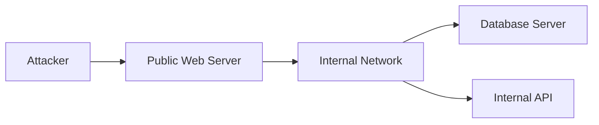
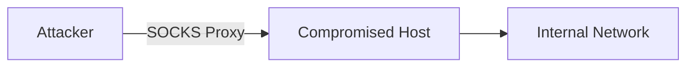
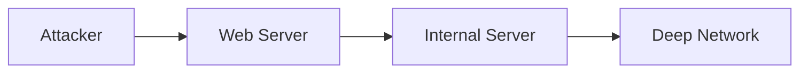

# Teknik Pivoting dalam Pentesting

## Apa itu Pivoting?

Pivoting adalah teknik dalam penetration testing di mana seorang attacker atau pentester menggunakan satu mesin yang sudah berhasil dikompromi sebagai "jembatan" untuk mengakses jaringan lain yang sebelumnya tidak bisa dijangkau secara langsung.

Secara sederhana, pivoting = **memanfaatkan foothold awal untuk menjelajah lebih dalam ke jaringan internal**.

Biasanya terjadi setelah tahap:

- Initial Access
- Exploitation

Pivoting sangat erat kaitannya dengan:

- Lateral Movement
- Network Segmentation bypass
- Internal reconnaissance

---

## Kenapa Pivoting Penting?

Di dunia nyata, sistem target jarang berdiri sendiri. Biasanya:

- Ada jaringan internal
- Ada server backend (database, API)
- Ada segmentasi (DMZ, internal LAN)

Contoh:

- Web server bisa diakses publik
- Database server hanya bisa diakses dari internal

Nah, pivoting memungkinkan:

> dari web server → masuk ke database server

---

## Konsep Dasar Pivoting

Bayangkan skenario berikut:



Tanpa pivot:

- Attacker hanya bisa akses **Web Server**

Dengan pivot:

- Attacker bisa:
  - Scan internal network
  - Akses database
  - Eksploit service internal

---

## Jenis-Jenis Pivoting

### 1. Network Pivoting

Menggunakan host yang sudah dikompromi untuk mengakses network lain.

Contoh:

- SSH tunneling
- Proxychains
- VPN pivot

---

### 2. Port Forwarding

Mengarahkan port dari mesin target ke mesin attacker.

Contoh:

```bash
ssh -L 3306:127.0.0.1:3306 user@target
```

Artinya:

- Port 3306 (MySQL) di target bisa diakses dari local attacker

---

### 3. SOCKS Proxy Pivot

Mengubah mesin compromised menjadi proxy.

Contoh tools:

- ssh -D
- chisel
- meterpreter (autoroute)

Diagram:



---

### 4. Application Layer Pivoting

Pivot lewat aplikasi:

- Web shell
- Reverse shell
- RCE endpoint

Biasanya digunakan untuk:

- Kirim request ke internal API
- SSRF chaining

---

## Tools yang Umum Digunakan

- **SSH**
- **Chisel**
- **Proxychains**
- **Metasploit (autoroute + socks)**
- **Ligolo-ng**
- **socat**

---

## Contoh Kasus Nyata

### Scenario: Web Server → Database Internal

#### Kondisi:

- Target: perusahaan
- Web server publik: `192.168.1.10`
- Database internal: `10.10.10.5`
- Database tidak expose ke internet

#### Step 1: Initial Access

Exploit web server:

```bash
nc -lvnp 4444
```

Dapat reverse shell.

---

#### Step 2: Recon Internal

Dari shell:

```bash
ip a
```

Terlihat:

```
10.10.10.2/24
```

Berarti:

- Mesin ini punya akses ke network internal

Scan:

```bash
nmap -sT 10.10.10.0/24
```

Ketemu:

```
10.10.10.5:3306 (MySQL)
```

---

#### Step 3: Pivoting

Gunakan port forwarding:

```bash
ssh -L 3306:10.10.10.5:3306 user@webserver
```

Sekarang di attacker:

```bash
mysql -h 127.0.0.1 -u root -p
```

→ langsung ke database internal

---

#### Step 4: Impact

- Dump database
- Ambil credential
- Escalate privilege
- Masuk ke sistem lain

---

## Strategi Pivoting (Praktis & Realistis)

### 1. Fokus pada Network Mapping

Jangan langsung exploit.

Cari:

- Interface
- Subnet lain
- Route table

Command:

```bash
ip route
netstat -rn
```

---

### 2. Enumerasi Internal Service

Gunakan:

- nmap (TCP scan dari dalam)
- curl (cek API internal)
- wget

---

### 3. Pilih Metode Pivot Sesuai Kebutuhan

| Kebutuhan            | Teknik             |
| -------------------- | ------------------ |
| Akses satu service   | Port forwarding    |
| Scan seluruh network | SOCKS proxy        |
| Stabil & cepat       | VPN pivot (ligolo) |

---

### 4. Minimalkan Noise

Jangan:

- Scan terlalu agresif
- Trigger IDS/IPS

Lebih baik:

- Scan bertahap
- Target spesifik

---

### 5. Gunakan Credential Reuse

Setelah pivot:

- Cari config file
- Dump password
- Gunakan ulang

Contoh:

```bash
cat /var/www/.env
```

---

### 6. Chain Pivot

Pivot bisa berlapis:



Semakin dalam:

- Semakin sensitif asset
- Semakin tinggi impact

---

## Risiko & Deteksi

Pivoting biasanya terdeteksi melalui:

- Anomali traffic internal
- Lateral movement detection
- Unusual port forwarding

Defender biasanya pakai:

- EDR
- Network segmentation
- Zero Trust

---

## Inti yang Harus Kamu Pahami

Pivoting bukan sekadar teknik, tapi mindset:

> "Kalau sudah masuk satu titik, jangan berhenti di situ."

Fokusnya:

- Eksplorasi
- Ekspansi akses
- Memanfaatkan trust antar sistem
